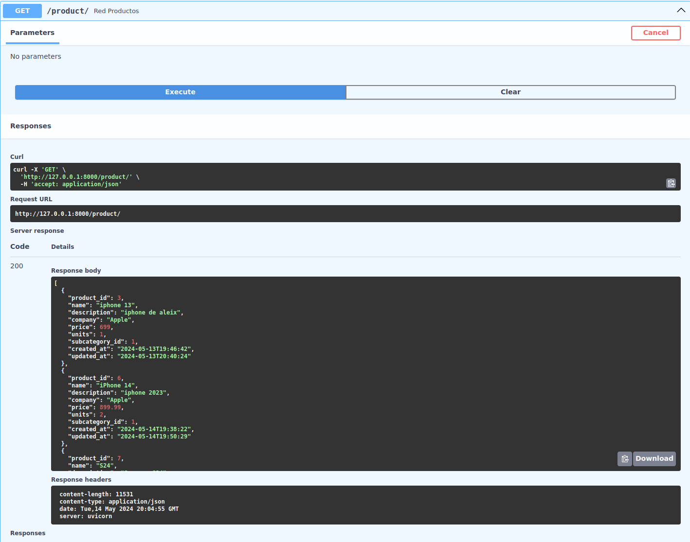
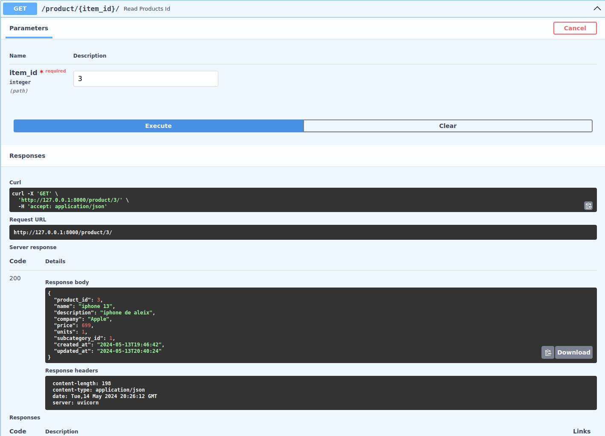
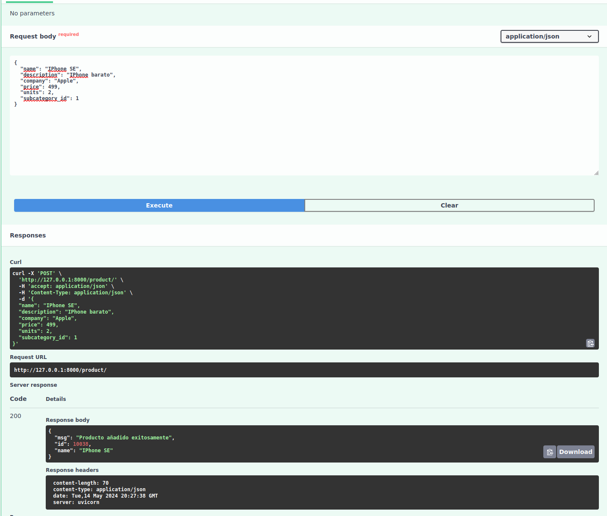
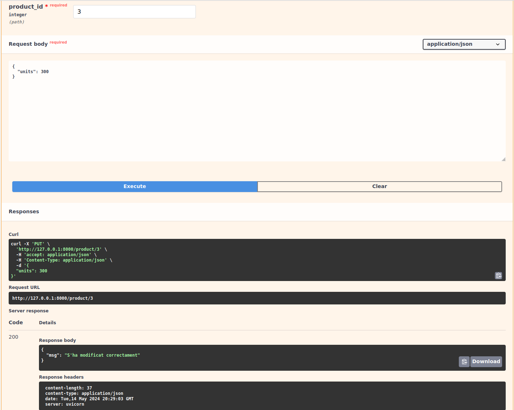
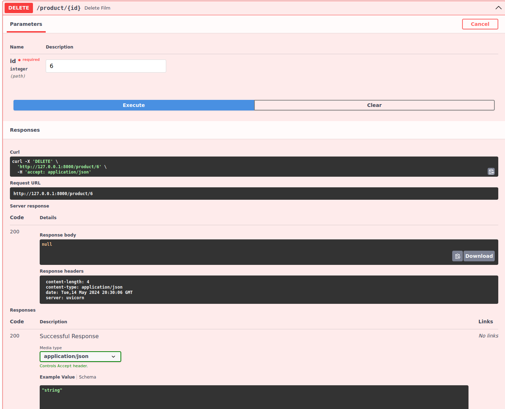
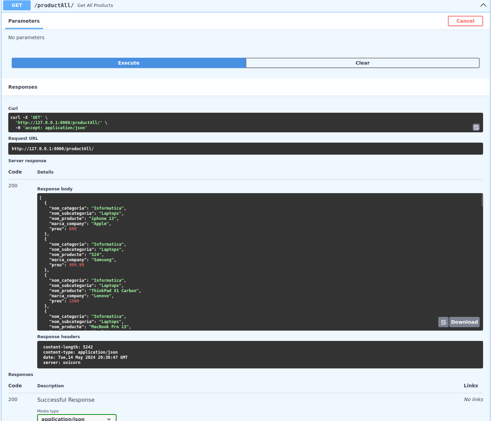
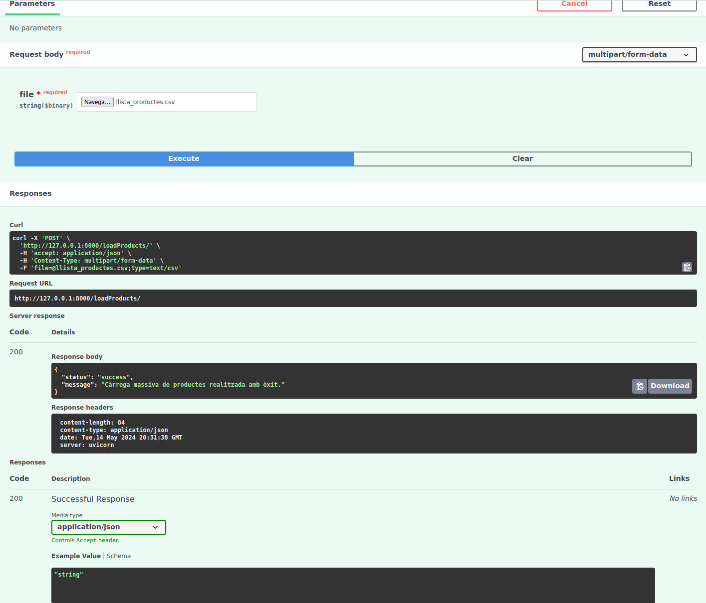

# M6_UF4
Practica1

En aquest exercici, farem servir FastAPI per crear una API per administrar una base de dades MariaDB. Implementem operacions CRUD en productes, categories i subcategories i proporcionem punts finals per crear, llegir, modificar i eliminar aquests registres. Afegirem una secció final per exportar dades des d'un fitxer CSV, editar o inserir registres segons calgui. A més, utilitzem consultes d'alt nivell fent servir paràmetres de consulta per filtrar, analitzar i registrar resultats.

Ruta:  /product/
Tipus de petició: Get
Funcionament: Retorna una llista json amb tota la informació dels productes de la taula products

Ruta:  /product/{id}
	Tipus de petició: Get
Funcionament: Retorna un objecte json amb la informació del producte que la id de la bases de dades coincideix amb la id que ens arribar per paràmetre.

Ruta:  /product/
	Tipus de petició: Post
	Funcionament: Permet afegir un nou producte a la BBDD
	Retorna un objecte json amb el missatge “S’ha afegit correctement”

Ruta:   /product
		/producte/{id}
	Tipus de petició: Put
	Funcionament: Permet modificar el camp d’un producte de la BBDD definit per la id que 		arribar per paràmetre.
	Retorna un objecte json amb el missatge “S’ha modificat correctement”

Ruta:  /product/{id}
	Tipus de petició: Delete
	Funcionament: Permet eliminar un producte de la BBDD
	Retorna un objecte json amb el missatge “S’ha borrat correctement”

Ruta:  /productAll/
	Tipus de petició: Get
	Funcionament: Retorna una llista json amb la següent informació: nom de la categoria, 	nom de la subcategoria, nom del producte, marca del producte i el preu.

Ruta:  /loadProducts
	Tipus de petició: Post
	Funcionament: Servirà per fer una càrrega massiva de categories, subcategories i 		productes a les bases de dades a través d’un fitxer csv.
Per cada registre del csv:
Per la categoria:
Si no existeix a les BBDD farà un insert a les bases de dades i modificarà el camps create_at i updated_at a la data i hora actual
Si existeix farà un update del name i actualiztarà updated_at a la data i hora actual.
Per la subcategoria:
Si no existeix a les BBDD farà un insert a les bases de dades i modificarà el camps create_at i updated_at a la data i hora actual
Si existeix farà un update del name i actualiztarà updated_at a la data i hora actual.
Pel producte :
Si no existeix a les BBDD farà un insert a les bases de dades i modificarà el camps create_at i updated_at a la data i hora actual
Si existeix farà un update del name i actualiztarà updated_at a la data i hora actual.

