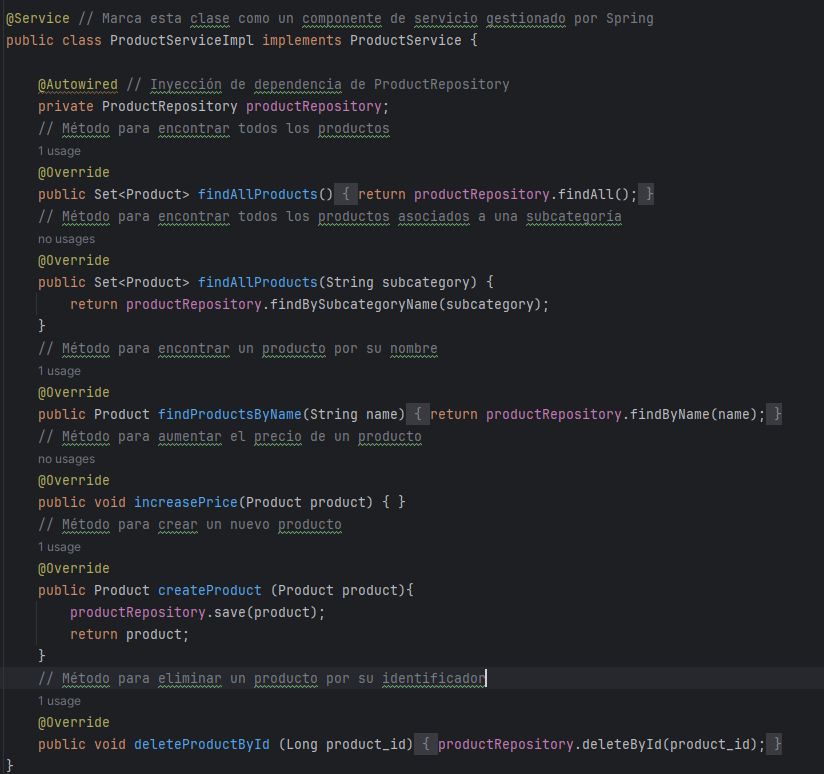

Botiga - Plataforma de Comercio Electrónico

Esta práctica cuenta con las siguientes características, tecnologías y funcionalidades: 

Características: 
1. Buscar y explorar productos por nombre y categoría.
2.  Crear nuevos productos y categorías.
3.  Eliminar productos existentes.

Tecnologías Utilizadas: 
1. Java 17
2. Spring Boot
3. Thymeleaf
3. Hibernate ORM
4. MariaDB
5. HTML
6. CSS

Funcionalidades: 

Antes que nada que he de decir que el IDE que usamos para trabajar en esta aplicación, fue IntellIJ, ya que en opinión propia, es el mejor IDE para trabajar con JAVA.

Para comenzar con está práctica comenzaremos creando los modelos de la base de datos, para esto necesitamos una base de datos ya creada, y crear los modelos desde la carpeta modelos.

Para ver los modelos creados, se necesitará acceder a la carpeta modelos y ver cada uno de los modelos creados. Finalmente al ejecutar la aplicación, se nos creará las tablas en nuestra base de datos.

Una vez creados los modelos, podemos comenzar creando los repositorios, servicios y implementación de estos mismos. 

Repositorios de los modelos:

CategoryRepository:

SubCategoryRepository:

ProductRepository:

Lo siguiente que se hace es crear los servicios de estos repositorios:

CategoryService:

SubCategoryService:

ProductService: 

Continuaremos implementando estos repositorios y servicios.

CategoryServiceImpl:

ProductServiceImpl:

SubCategoryServiceImpl

Al tener todos los métodos implementados, proseguiremos con llamarlos en el WebController.

Definimos el controlador y asignamos variables a ProductService y SubCategoryService.

Este método nos devuelve un listado de productos

Con este podemos ver un filtrado por nombre de la aplicación 

Con el siguiente método se creara un nuevo producto y nos redirigirá a otro html con la correcto insertado del nuevo producto. 

Y finalmente tenemos la eliminación de un producto, que si bien no está implementado, esta listo para que si. 

Podemos comprobar todo desde la terminal de la base de datos.

